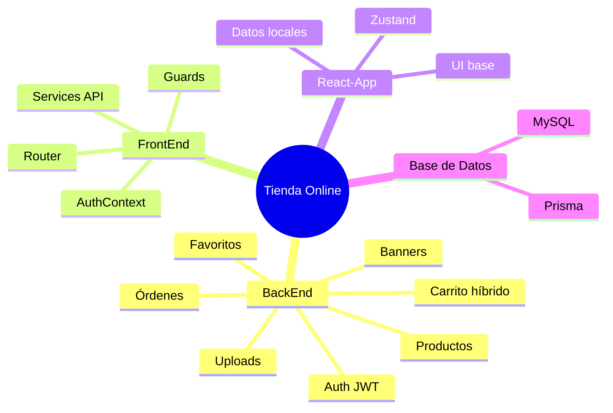

# 00-Resumen

## Descripción general actual
Este repositorio contiene una tienda online separada por capas y por aplicaciones:

- **BackEnd/**: API REST en Node.js + Express + TypeScript + Prisma (MySQL).
- **FrontEnd/**: frontend React + TypeScript orientado a consumir la API real (`/api/v1`).
- **react-app/**: frontend React + TypeScript de base visual (catálogo/carrito local) usado como referencia y evolución UI.

## Objetivo del proyecto
Consolidar un e-commerce completo con:

- catálogo de productos,
- autenticación con JWT (access/refresh),
- carrito invitado + carrito autenticado con merge,
- órdenes,
- favoritos,
- administración de productos y banners.

## Stack tecnológico

### Backend
- Express 4 + TypeScript.
- Prisma ORM + MySQL.
- Zod para validaciones.
- JWT + roles (`ADMIN`, `CUSTOMER`).
- Multer + carpeta local `uploads/` para imágenes.

### Frontend integrado (FrontEnd)
- React 18 + Vite + TypeScript.
- React Router.
- Capa `services` conectada a `VITE_API_URL` (default `http://localhost:4000/api/v1`).
- Gestión de sesión en `AuthContext` + tokens en `localStorage`.

### Frontend visual/legacy (react-app)
- React 18 + Vite + TypeScript.
- Zustand para estado de tienda.
- Servicios locales/mocks para productos y carrito.

## Estado actual
- **Backend funcional por dominios** (`auth`, `products`, `cart`, `favorites`, `orders`, `banners`).
- **FrontEnd** ya integra autenticación, productos, carrito, órdenes y guards de rutas.
- **react-app** funciona como base de UI y pruebas de componentes, con datos locales.

## Mapa rápido

