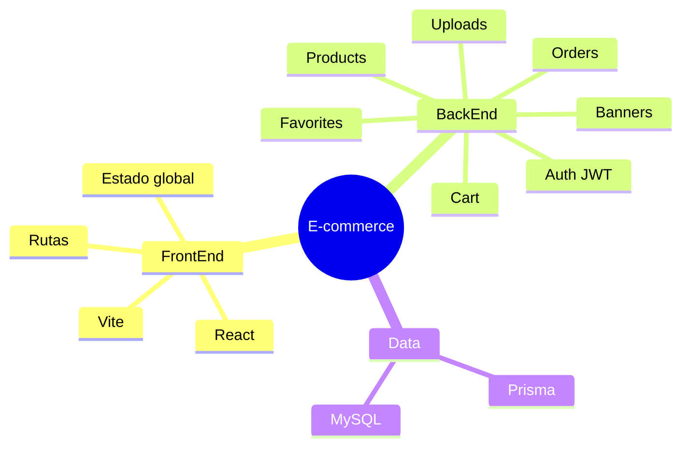

# 00-Resumen

## Descripción general
Proyecto web e-commerce dividido en:
- **FrontEnd**: React + Vite.
- **BackEnd**: Node.js + Express + TypeScript + Prisma + MySQL.

## Objetivo del proyecto
Construir una tienda online con catálogo, autenticación, carrito híbrido (usuario/invitado), órdenes y gestión administrativa incremental.

## Stack tecnológico
- **UI**: React, Vite.
- **API**: Express (TypeScript).
- **Datos**: Prisma ORM + MySQL.
- **Seguridad**: JWT (access/refresh), roles `ADMIN` / `CUSTOMER`.
- **Validaciones**: Zod.
- **Uploads**: Multer + almacenamiento local (`/uploads`).

## Estado actual
- Backend en estado **MVP funcional** por módulos.
- Frontend pendiente de integración completa contra API real.
- Base sólida para continuar implementación por fases.

## Mapa rápido del sistema

