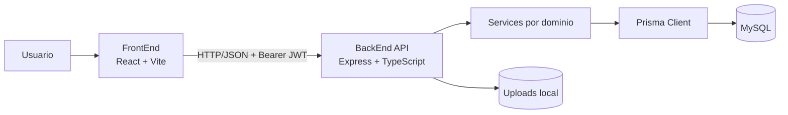
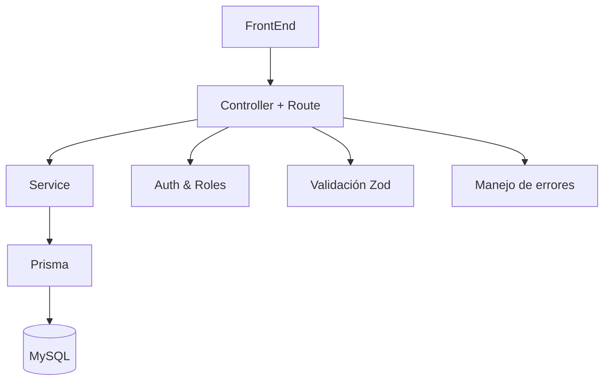

# 01-Arquitectura

## Diagrama general del sistema

## Capas del sistema

### 1) FrontEnd
Responsable de UI, navegación, estado de sesión y consumo de endpoints.

### 2) API (Express)
Expone rutas REST (`/api/v1`), aplica middlewares (CORS, auth, validación, errores) y orquesta casos de uso.

### 3) Services
Contienen la lógica de negocio por dominio (`auth`, `products`, `cart`, etc.).

### 4) Prisma
Capa de acceso a datos tipada para consultas y mutaciones.

### 5) MySQL
Persistencia principal de usuarios, productos, carritos, órdenes, favoritos, banners y tokens.

## Vista de responsabilidades

