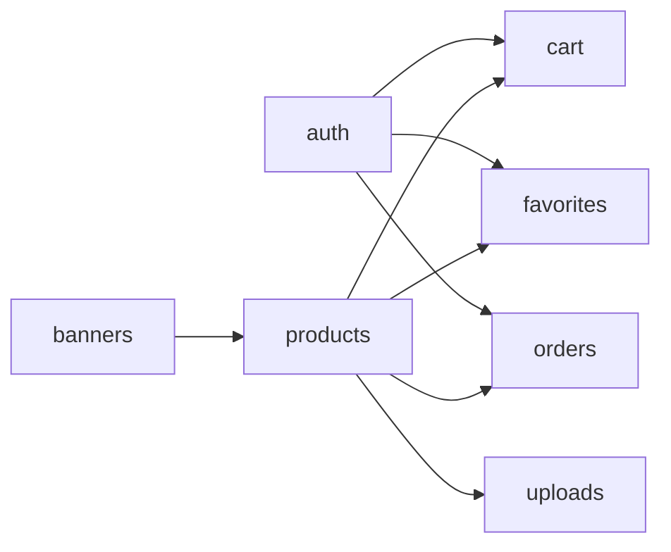

# 02-Modulos

## Módulos backend activos

| Módulo | Responsabilidad | Endpoints base |
|---|---|---|
| `auth` | registro, login, refresh, sesión actual, logout | `/auth/*` |
| `products` | listado, detalle y ABM admin + imágenes | `/products/*` |
| `cart` | carrito de invitado y autenticado + merge | `/cart/*` |
| `favorites` | favoritos por usuario autenticado | `/favorites/*` |
| `orders` | checkout simulado y consulta de órdenes | `/orders/*` |
| `banners` | banners públicos y gestión admin | `/banners/*` |
| `uploads` | almacenamiento local para imágenes | `static /uploads/*` |

## Módulos frontend (FrontEnd)

| Carpeta | Responsabilidad |
|---|---|
| `services/` | contratos de consumo API por dominio (`auth`, `products`, `cart`, `orders`) |
| `context/` | sesión y estado global de autenticación (`AuthContext`) |
| `routes/` | router principal y guards (`SessionGuard`, `RoleGuard`) |
| `pages/` | pantallas funcionales (`Products`, `Cart`, `Orders`, `Admin`, auth) |
| `lib/api/` | cliente HTTP, refresh automático y gestión de tokens |

## Relación entre módulos

## Dependencias funcionales clave
- `orders.checkout` depende del estado actual del carrito y crea snapshots de producto/precio.
- `cart.merge` conecta flujo guest con sesión autenticada.
- `FrontEnd/AuthContext` dispara merge de carrito tras login/registro.
