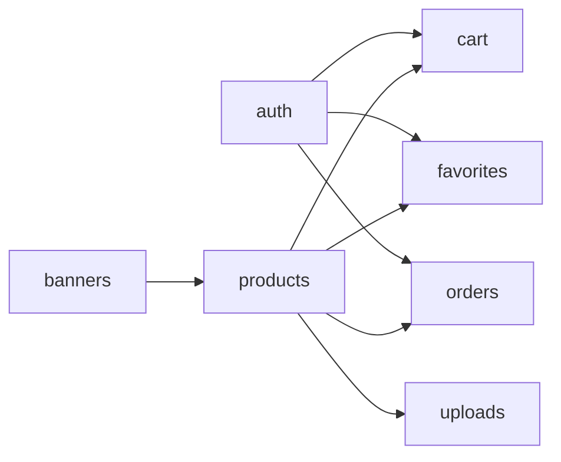

# 02-Modulos

## Módulos del sistema

| Módulo | Función principal | Endpoints típicos |
|---|---|---|
| `auth` | Registro, login, refresh, perfil | `/auth/register`, `/auth/login`, `/auth/me` |
| `products` | Catálogo, detalle, ABM admin, imágenes | `/products`, `/products/:id` |
| `cart` | Carrito de invitado y autenticado, merge | `/cart`, `/cart/items`, `/cart/merge` |
| `favorites` | Favoritos por usuario | `/favorites` |
| `orders` | Checkout y consulta de órdenes | `/orders/checkout`, `/orders/:id` |
| `banners` | Gestión de banners públicos/admin | `/banners` |
| `uploads` | Subida y URL pública de imágenes | `/uploads/*` |

## Relación entre módulos

## Dependencias funcionales clave
- `orders` depende de `cart` + snapshots de `products`.
- `cart` y `favorites` dependen del catálogo de `products`.
- `uploads` soporta imágenes del catálogo.
