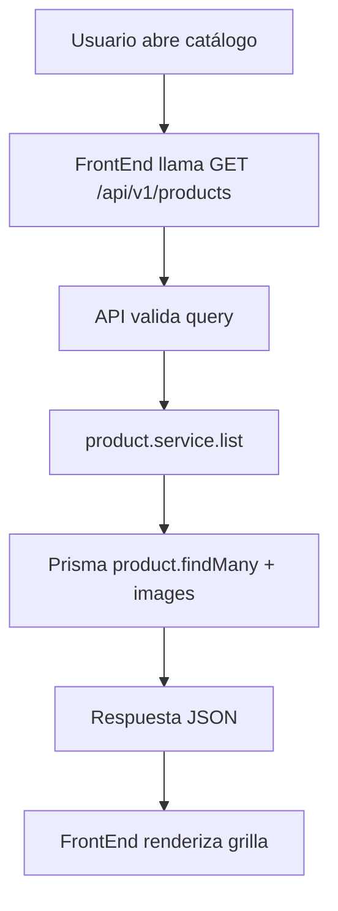
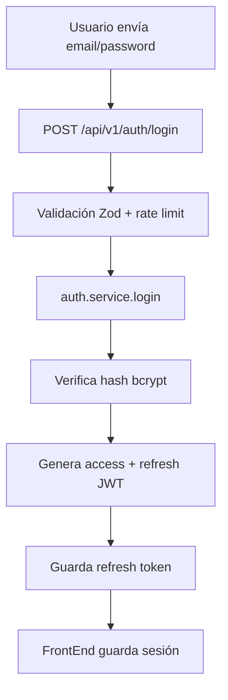
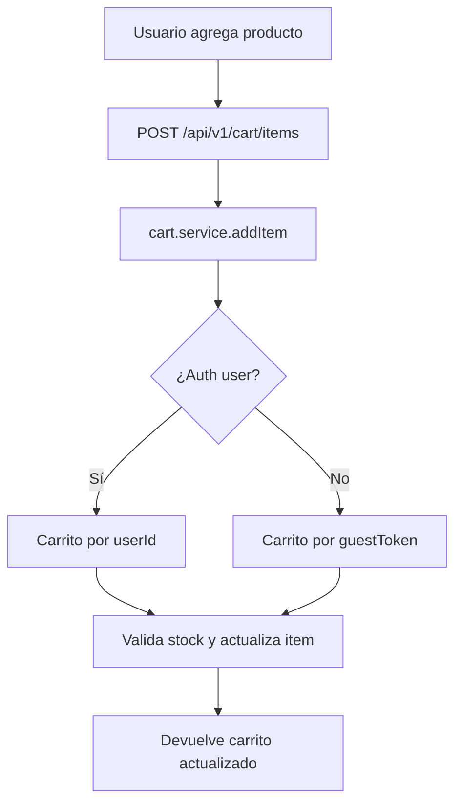
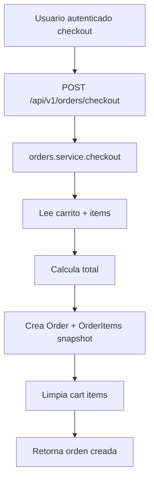

# 03-Flujos

## 1) Ver productos

```mermaid
flowchart TD
  A[Usuario abre catálogo] --> B[FrontEnd llama GET /api/v1/products]
  B --> C[API valida query]
  C --> D[product.service.list]
  D --> E[Prisma product.findMany + images]
  E --> F[Respuesta JSON]
  F --> G[FrontEnd renderiza grilla]
```

## 2) Login de usuario

```mermaid
flowchart TD
  A[Usuario envía email/password] --> B[POST /api/v1/auth/login]
  B --> C[Validación Zod + rate limit]
  C --> D[auth.service.login]
  D --> E[Verifica hash bcrypt]
  E --> F[Genera access + refresh JWT]
  F --> G[Guarda refresh token]
  G --> H[FrontEnd guarda sesión]
```

## 3) Agregar al carrito

```mermaid
flowchart TD
  A[Usuario agrega producto] --> B[POST /api/v1/cart/items]
  B --> C[cart.service.addItem]
  C --> D{¿Auth user?}
  D -- Sí --> E[Carrito por userId]
  D -- No --> F[Carrito por guestToken]
  E --> G[Valida stock y actualiza item]
  F --> G
  G --> H[Devuelve carrito actualizado]
```

## 4) Crear una orden (checkout)

```mermaid
flowchart TD
  A[Usuario autenticado checkout] --> B[POST /api/v1/orders/checkout]
  B --> C[orders.service.checkout]
  C --> D[Lee carrito + items]
  D --> E[Calcula total]
  E --> F[Crea Order + OrderItems snapshot]
  F --> G[Limpia cart items]
  G --> H[Retorna orden creada]
```
