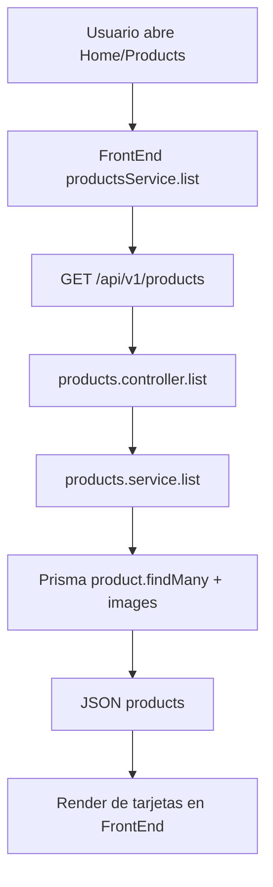
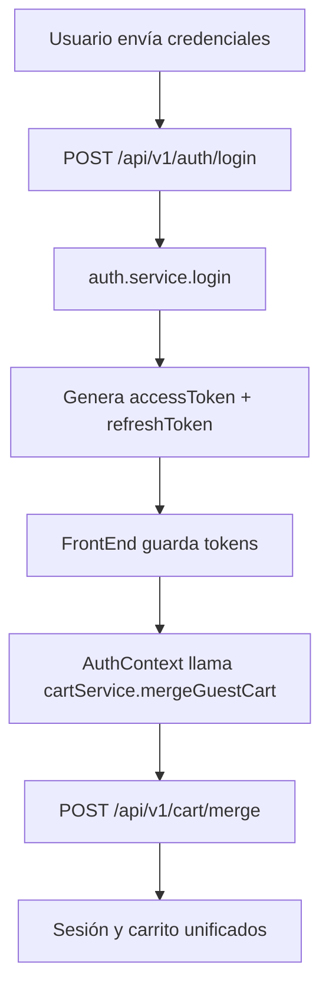
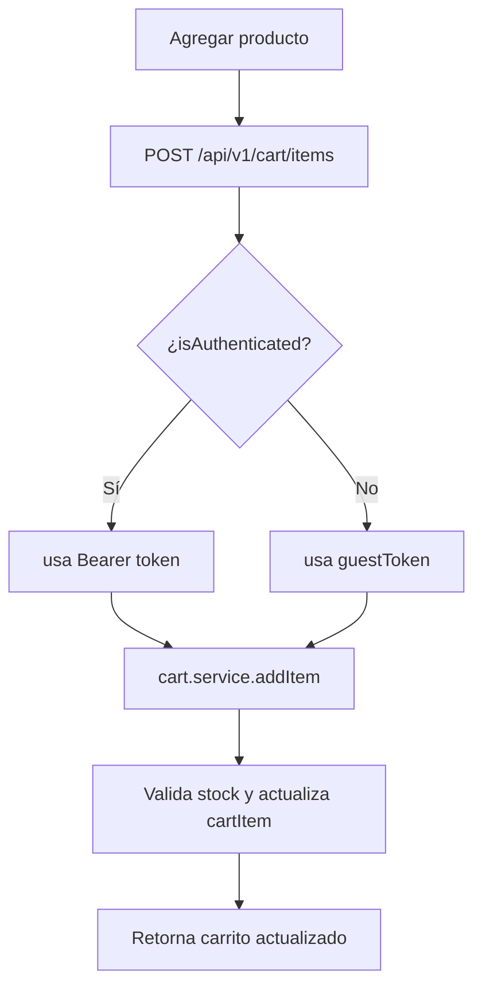
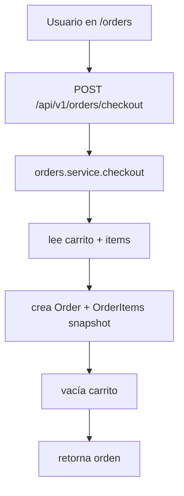
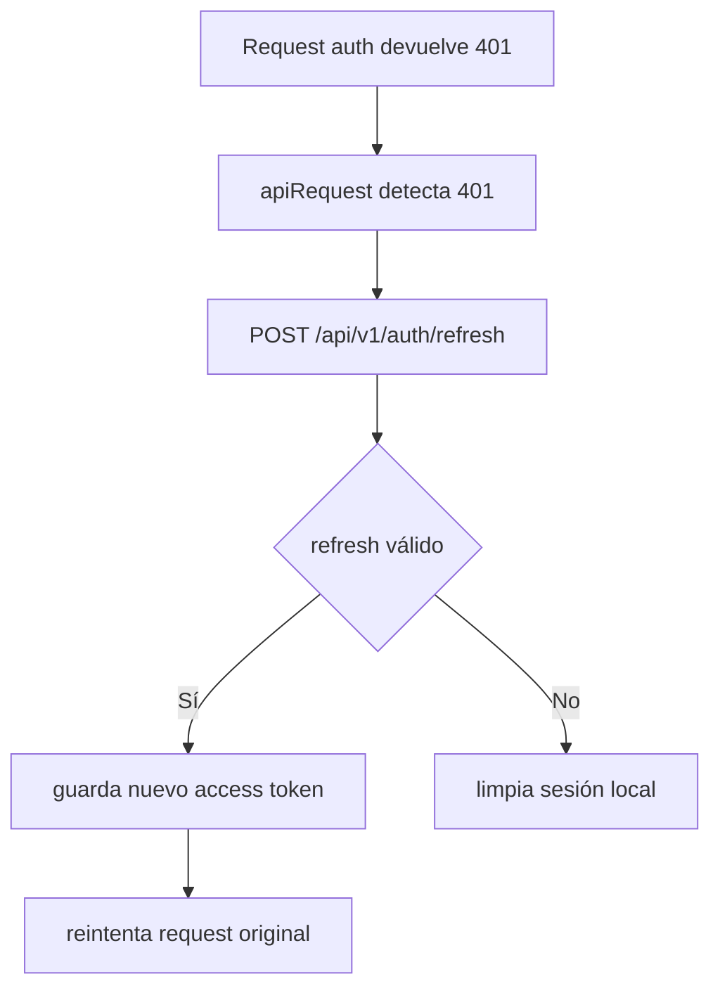

# 03-Flujos

## 1) Catálogo de productos (público)

## 2) Login + recuperación automática de sesión

## 3) Carrito híbrido (guest/auth)

## 4) Checkout autenticado

## 5) Refresh de access token en frontend

