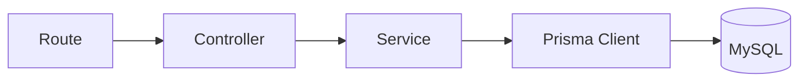
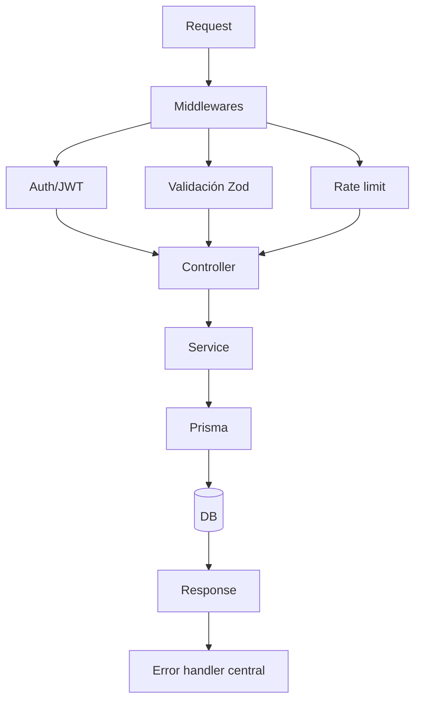

# 05-Backend

## Arquitectura actual del backend

El backend sigue una estructura modular por dominio, con separación de responsabilidades:

- `modules/`: dominios (`auth`, `products`, `cart`, `favorites`, `orders`, `banners`, `uploads`).
- `routes/`: composición de rutas versionadas (`/api/v1`).
- `controllers/`: capa HTTP (request/response).
- `services/`: lógica de negocio y reglas.
- `prisma/`: cliente y modelo de datos.
- `shared/`: middlewares, errores, utilidades, tipos globales.

## Flujo interno estándar

## Flujo con middleware

## Fortalezas actuales
- Base modular clara para escalar.
- Integración de seguridad y validación desde la capa HTTP.
- Prisma simplifica mantenibilidad del acceso a datos.
