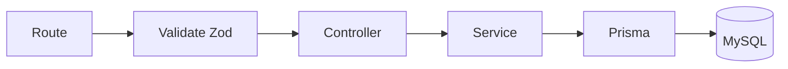

# 05-Backend

## Estructura backend actual
```text
BackEnd/
  src/
    app.ts
    server.ts
    config/
    routes/
    modules/
      auth/
      products/
      cart/
      favorites/
      orders/
      banners/
      uploads/
      admin/ (documentación)
      users/ (documentación)
    prisma/
    shared/
  prisma/
    schema.prisma
    migrations/
    seed.ts
  uploads/
```

## Flujo interno estándar


## Middlewares globales
- `helmet` para cabeceras de seguridad.
- `cors` con origen configurado por variable de entorno.
- `morgan` para logging HTTP.
- `express.json` para parseo de payload JSON.
- `notFoundHandler` + `errorHandler` centralizados.

## Seguridad por endpoint
- `requireAuth` en rutas privadas.
- `requireRole(UserRole.ADMIN)` en operaciones administrativas.
- Validación de payload/query/params con esquemas Zod por módulo.

## Endpoints versionados
Base: `GET/POST/... /api/v1`

- `/health`
- `/auth/*`
- `/products/*`
- `/cart/*`
- `/favorites/*`
- `/orders/*`
- `/banners/*`
- `/uploads/*` (estático)

## Fortalezas actuales
- Dominio de e-commerce bien cubierto para MVP ampliado.
- Modelo de datos preparado para OAuth y proveedor de pago externo.
- Diseño orientado a migración progresiva desde frontend local/mocks.
