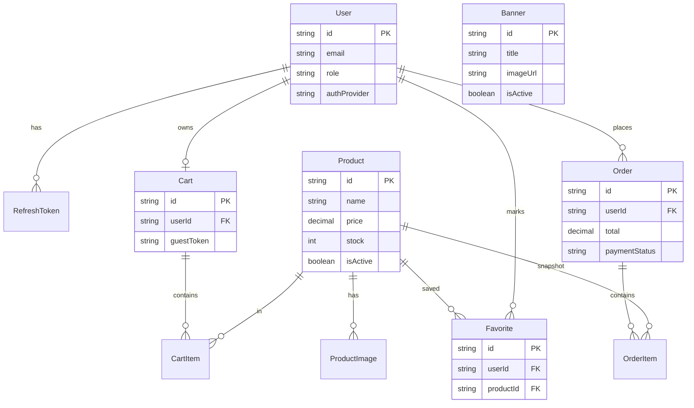

# 06-BaseDeDatos

## Modelo conceptual

### Entidades principales
- **User**: identidad, rol, proveedor auth.
- **Product**: catálogo, precio, stock, atributos, activo/destacado.
- **Cart**: carrito por usuario o invitado.
- **Order**: orden de compra con estado y pago.
- **Favorite**: relación usuario-producto favorito.
- **Banner**: contenido promocional.

## Relaciones clave
- Un `User` puede tener múltiples `Order`, `Favorite` y `RefreshToken`.
- `Cart` se asocia a `User` (opcional) o `guestToken`.
- `Cart` contiene múltiples `CartItem`, cada uno asociado a un `Product`.
- `Order` contiene múltiples `OrderItem` con snapshots de datos.

## ERD (Mermaid)

## Nota de diseño
El modelo ya contempla evolución hacia OAuth y pasarelas de pago reales sin rediseño total.
