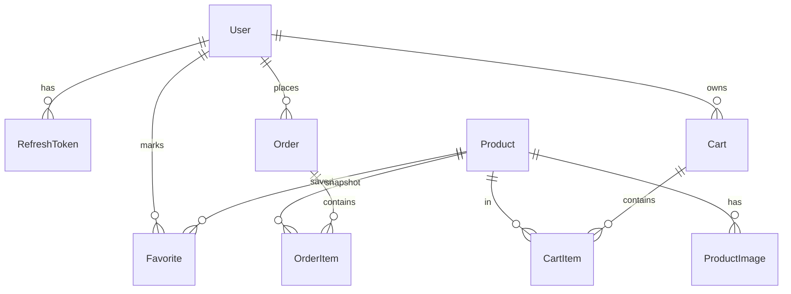

# 06-BaseDeDatos

## Motor y acceso
- Motor: **MySQL**.
- ORM: **Prisma** (`BackEnd/prisma/schema.prisma`).

## Entidades principales
- `User`
- `RefreshToken`
- `Product`
- `ProductImage`
- `Cart`
- `CartItem`
- `Favorite`
- `Order`
- `OrderItem`
- `Banner`

## Relaciones clave
- `User` 1:N `RefreshToken`, `Favorite`, `Order`.
- `User` 1:N `Cart` (con unicidad por `userId`).
- `Cart` 1:N `CartItem`.
- `Product` 1:N `ProductImage`, `CartItem`, `OrderItem`.
- `Favorite` resuelve N:M entre `User` y `Product`.
- `Order` 1:N `OrderItem`.

## Reglas y constraints relevantes
- `Cart` tiene `@@unique([userId])` y `@@unique([guestToken])`.
- `CartItem` tiene `@@unique([cartId, productId])`.
- `Favorite` tiene `@@unique([userId, productId])`.
- `OrderItem` persiste snapshots (`productNameSnapshot`, `unitPriceSnapshot`) para trazabilidad histórica.

## ERD simplificado

## Decisiones de evolución ya soportadas
- `authProvider` y `providerId` en `User` para OAuth futuro.
- `paymentProvider` y `externalPaymentId` en `Order` para integrar pasarela real.
