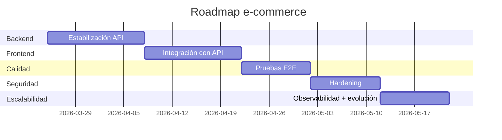

# 07-Roadmap

## Fase 1: Estabilización backend
- Corregir type-check y contratos de auth.
- Normalizar respuestas de error (401/403/400).
- Endurecer permisos en carrito invitado/autenticado.
- Definir tests mínimos de API.

## Fase 2: Integración frontend
- Conectar React al backend por dominio (`auth`, `products`, `cart`, `orders`).
- Implementar guards de rutas por sesión/rol.
- Unificar manejo de tokens y refresh.

## Fase 3: Pruebas E2E
- Flujos críticos: login, catálogo, carrito, checkout.
- Verificación de escenarios guest -> login -> merge cart.
- Cobertura de rutas admin.

## Fase 4: Seguridad
- Rotación/revocación de refresh tokens.
- Auditoría de endpoints y validaciones.
- Revisión de límites, uploads y políticas CORS por ambiente.

## Fase 5: Escalabilidad futura
- Observabilidad (logs estructurados, métricas básicas).
- Preparación para provider de pago real.
- Hardening de arquitectura para despliegue multi-entorno.

## Vista temporal resumida

