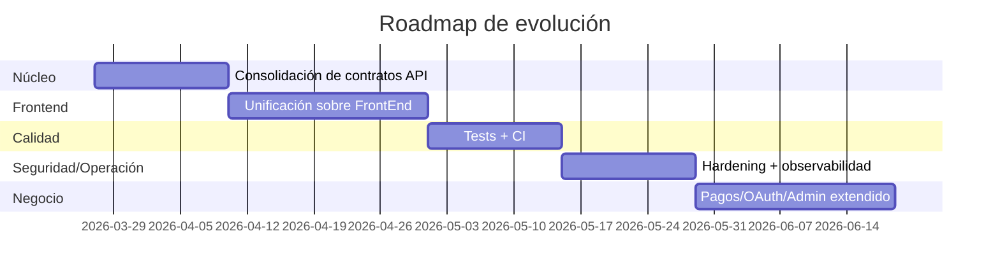

# 07-Roadmap

## Objetivo del roadmap
Pasar de un ecosistema mixto (frontend integrado + frontend visual legacy) a una plataforma unificada con calidad de producción inicial.

## Fase 1 — Consolidación API + contratos (corto plazo)
- Mantener `BackEnd` como fuente única de verdad para dominio e-commerce.
- Documentar contratos de respuesta por endpoint (tipos y errores).
- Validar consistencia de códigos HTTP y mensajes de error.

## Fase 2 — Unificación frontend (corto/medio plazo)
- Priorizar `FrontEnd/` como cliente oficial de la API.
- Migrar componentes y mejoras visuales valiosas desde `react-app/` hacia `FrontEnd/`.
- Homologar diseño, navegación y estados UX (loading/empty/error).

## Fase 3 — Calidad automatizada (medio plazo)
- Backend: typecheck + tests de integración por módulos críticos (`auth`, `cart`, `orders`).
- Frontend: tests unitarios/componentes + smoke e2e de flujos clave.
- CI: pipeline mínimo con `build`, `lint/typecheck`, `test`.

## Fase 4 — Seguridad y operación (medio plazo)
- Endurecer políticas de refresh/revocación de tokens.
- Mejorar observabilidad (logs estructurados y métricas básicas).
- Definir ambientes (`dev`, `staging`, `prod`) con configuración de CORS/URLs.

## Fase 5 — Escalabilidad de negocio (mediano/largo plazo)
- Integrar pasarela de pago real.
- Incorporar OAuth/social login.
- Añadir panel admin más completo (inventario, banners, órdenes).

## Línea temporal sugerida

